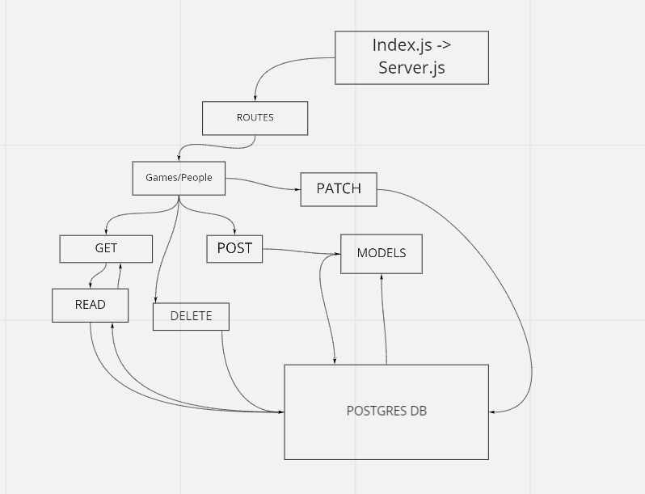

# basic-api-server

A basic API server to be hosted on Heroku. Uses PostGres DB to store two schemas of data.

This one has games (title and release year) and people (names and year of birth).

## Installation

to install run `git clone git@github.com:ryanyinlee/basic-api-server.git`

`cd` basic-api-server

run `npm init -y`

`npm i dotenv express jest lint node pg router routes sequelize sequelize-cli sqlite3 supertest`

## Usage

`npm start` to run server

`npm test` to test server in terminal

## Routes

CRUD is identical for games and people.

router.get('/game', read)
router.get('/game/:id', read)
router.post('/game', create)
router.patch('/game/:id', update)
router.delete('/game/:id', remove)

router.get('/people', read)
router.get('/people/:id', read)
router.post('/people', create)
router.patch('/people/:id', update)
router.delete('/people/:id', remove)

**Special Use Only**

router.delete('/removeallgames', removeallgames) // for testing only modify the 92 to delete the IDs. 

I'll eventually get the logic do delete anything on the DB, but it's not necessary now.

## Current Deploys/GitHub Repository

GitHubRepository

https://github.com/ryanyinlee/basic-api-server

Dev Branch:

https://ryanlee-basic-api-server.herokuapp.com/

Main/Production - Due to Heroku limitations this hasn't been used. Just running dev.

https://ryanlee-basic-api-server.herokuapp.com/

## UML

Need more UML help, here's what I got so far.

